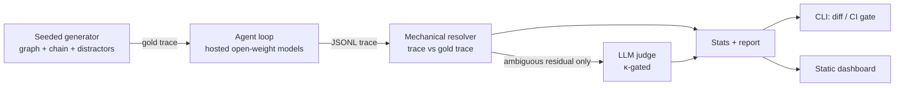

# LoopGuard

**A controlled study of how tool-using LLM agents fail as reasoning depth increases — and what fixing it costs.**

> **Status: design complete, implementation in progress.** The experimental design ([`prd.md`](prd.md)) and technical spec ([`trd.md`](trd.md)) are finished and reviewed. Phase 0 scaffolding is next. **No results exist yet** — nothing in this README should be read as a finding.

---

## The question

Every agent gets less reliable as you chain more tool calls. That's common knowledge. What's uncommon is being able to answer, for *your* agent: **why**, at what depth it starts, and whether the fix you shipped worked for the reason you think it did.

Most evals answer this with a single aggregate accuracy number. That's not a decision input. It tells you a deeper loop is worse; it doesn't tell you whether your agent is fabricating IDs, picking the wrong tool, or confidently grabbing a real-but-wrong value it saw three hops ago. Those have different fixes, and an aggregate number hides which one you have.

LoopGuard is built to answer it properly for two open-weight models (Llama 3.3, Qwen3).

## What makes this different from a benchmark run

**Loop depth is the only variable that moves.** Tool count, distractor density, per-hop payload size, task template, and system prompt are held constant by construction across depths 1–5. Real benchmarks vary all of these at once, which makes their depth-vs-accuracy curves uninterpretable.

**Failures are attributed mechanically, not by an LLM judge.** The task generator emits a *gold trace* — ground truth for every intermediate hop, not just the final answer. Attribution is deterministic comparison against it. A judge handles only the residual, is capped at 20% of failures, and its labels don't count unless Cohen's κ ≥ 0.70 against a hand-labeled fixture set. That gate is enforced in code, not by discipline.

**The mitigation is chosen because it targets the diagnosed failure mode** — with its mechanism and predicted direction written down and committed *before* the arm runs. It's measured on that specific failure category, with off-target categories reported alongside, so a "win" that merely displaces failures into another bucket is visible.

**Reliability is priced, not celebrated.** Every mitigation result carries its token and latency overhead. The headline is "cuts context-pollution at depth 5 by X points for Y% more tokens," never a bare accuracy delta.

**It ships as a CI gate.** A `loopguard gate` command diffs failure rates between agent versions and fails the build on regression — with a distinct exit code for "underpowered run, cannot decide," so a truncated run can't pass vacuously.

## Design problems found before writing code

These surfaced while specifying the system. Each would have silently invalidated results — producing plausible numbers that meant nothing. Finding them cost a day of writing; finding them after a full run would have cost the run.

**Tokenizers disagree, so "length-matched payloads" wasn't well-defined.** The design requires tool responses matched to ±10% tokens across hops. But Llama 3.3 and Qwen3 tokenize differently — there is no single token count. Resolved by matching against a reference tokenizer, asserting a looser bound under the second, and reporting both realized counts rather than claiming exact matching.

**A naive resolver would have inflated the tool-misuse rate.** If any non-gold tool call counts as misuse, then an agent that reasonably calls a broad `search_entities` before the correct narrow tool gets penalized for good behavior — and `TOOL_MISUSE` is a headline category. Fixed with an exploration budget and tool tagging. Since that budget is a researcher degree of freedom that moves a reported number, it's frozen with the calibration config and sensitivity-checked at ±1.

**1,200 episodes are not 1,200 independent observations.** Three decoding repeats nest within each task. Treating them as independent would inflate apparent significance roughly threefold — enough to manufacture a result. Task-level (n=40/cell) is the primary unit for all confidence intervals and paired tests; episode-level is secondary and used only for failure-mode composition.

**Infrastructure timeouts would have manufactured the headline finding.** Deeper episodes run longer, so they exhaust retry budgets more often. Grading those as agent failures produces a beautiful depth-degradation curve that is entirely an artifact of provider flakiness. Infra failures are excluded from failure-rate denominators, counted separately, and a per-cell count that isn't flat across depths is treated as evidence the curve is suspect.

## Guards against fooling myself

The hardest part of an eval isn't running it — it's not talking yourself into the result you wanted.

- **Difficulty calibration is frozen to a committed lock file** before headline runs, and the harness refuses to start if the lock hash doesn't match the config. Re-tuning after seeing results requires deliberately editing two files together.
- **Mitigation mechanism is pre-registered** — written down before the arm runs, so a mitigation that works for unrelated reasons gets flagged rather than claimed.
- **The κ ≥ 0.70 judge gate auto-relabels** below threshold, because the temptation to accept a 0.68 is real.
- **Seeds derive deterministically from a config hash**, and the hash deliberately excludes runtime-only fields — otherwise changing parallelism would reseed the task set and silently break the paired baseline↔mitigation comparison.
- **A negative result counts as success.** If the mitigation doesn't help, or helps only by displacing failures, the project has still delivered. The deliverable is a trustworthy measurement, not a win.

## Pipeline

## Failure taxonomy

| Category | What it means |
|---|---|
| `HALLUCINATION` | Used a value that never appeared in any tool response — invented from nothing |
| `TOOL_MISUSE` | Wrong tool for the hop, malformed arguments, or unproductive exploration past budget |
| `CONTEXT_POLLUTION` | Used a value that *did* appear in context but belongs to a distractor or an earlier hop — real value, wrong selection |
| `NON_TERMINATION` | Exhausted step or token budget without answering |

Every failure is attributed to the **first divergence** from the gold trace, not the final answer. The hop index where the chain breaks is a first-class reported quantity — it's the strongest available signal for whether depth degrades reasoning or merely offers more chances to fail.

## Stack

Python 3.11 · uv · Pydantic v2 · scipy/statsmodels · pytest · ruff · mypy
Dashboard: Vite · React · TypeScript · Recharts (static export, no backend)
Inference: hosted open-weight models over the OpenAI-compatible wire format

## Repo

| | |
|---|---|
| [`prd.md`](prd.md) | Experimental design, failure taxonomy, success criteria — *what* and *why* |
| [`trd.md`](trd.md) | Stack, schemas, resolver algorithm, CLI/CI specs — *how* |
| [`CLAUDE.md`](CLAUDE.md) | Load-bearing invariants; the constraints that make results valid |

## Roadmap

- [ ] **Phase 0** — Scaffolding, provider client, trace format
- [ ] **Phase 1** — Task generator, difficulty calibration, frozen lock file
- [ ] **Phase 2** — Baseline run, mechanical resolver, judge calibration (κ reported)
- [ ] **Phase 3** — Diagnose dominant failure mode, pre-register and test one mitigation
- [ ] **Phase 4** — Cost accounting: reliability per 1k tokens
- [ ] **Phase 5** — Regression CLI and CI gate
- [ ] **Phase 6** — Static dashboard with trace inspector
- [ ] **Phase 7** — Findings writeup with stated limitations

---

**Arsalon Amini** — [LinkedIn](https://www.linkedin.com/in/arsalonamini/) · arsalon.ai@gmail.com

A side project on agent evaluation methodology. Feedback and disagreement welcome — particularly on the experimental design, which is the part worth getting right.
